# About Me:
```
Building applications one **sting**-fueled commit at a time.
```
Hey, I'm **Gab** 👋
- Full-stack developer focused on clean architecture and scalable APIs
- Currently building SRSLY, a spaced-repetition platform for LeetCode review
- Learning more about system design and distributed systems every day
- Java enjoyer ☕
- Gym rat after office hours

My goal is to eventually work on large-scale systems where performance, reliability, and good engineering practices matter at scale.

## Tech Stack:
               



<!-- Proudly created with GPRM ( https://gprm.itsvg.in ) -->
